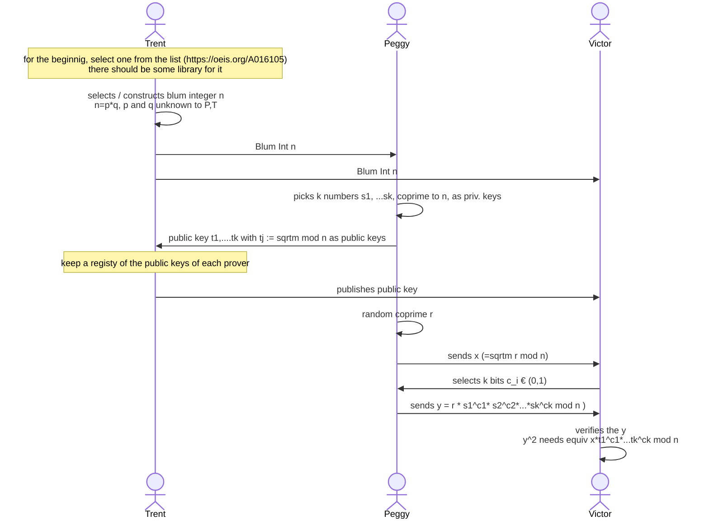
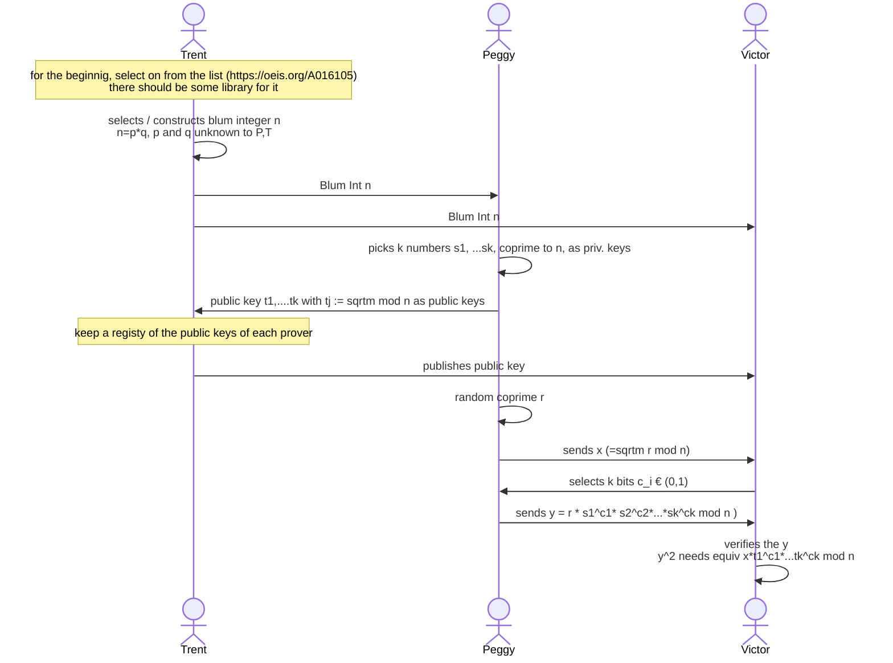
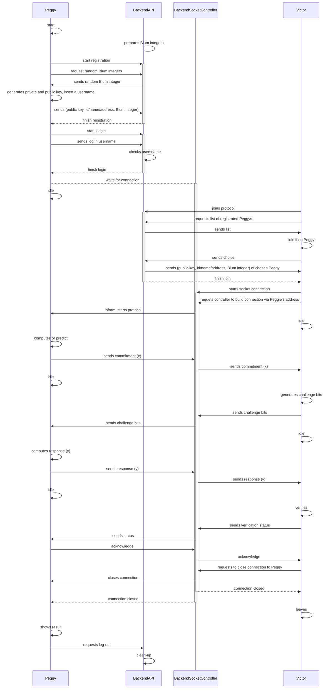

# Sequence Diagram (iterative )

## Fiat Shamir

## Feige Fiat Shamir

link FS
https://www.mermaidchart.com/play#pako:eNqFUstOwzAQ_JVRTykKz2NFe6goEhIChBCnCilx3NRq7E1tBxohLnwPX8WX4DgJiUKBXOxYM7szs_s6YpTw0WRk-LbgivELEaU6kkuF5ouYJY0HzZUdPt7xNC2Hj4-iOrpXzzyczfyJSS7YxuAMOlIJSWSRTjlyLSQ3CPJwOz6P9fEMimJKSmwUvRjYNZc_C_ruE8yzQuLKlVbBND_YjgdAOGSjqY_tUL6MR9W3CWqJJgQjLwyW9hPqso5hqkYWgdlqK2EgKYFySjrSNVEOTYVKQCs8cy1WgkVWUA_zu6ImrFaP_ovTF5UY7BBMa1n6W1ZLuiHLQU5MHVXYxnQHxbnjOt-MpBQWMdk1WGTckOaLy9v7BR7B1lT9u-GAoZ6akHl25DhFlqAwHBmxTUw7hxLKWB5584NV6pQ3G9L2LLFyPnqdAx1Cmx8uGsMD7xlntqL45LJy7DR-vn8gOAlP93N99zY1Vnnfu8n7Mi4RVFKrJLRI1xbsH3n1_Jvwyia88umsyz12oZJKj7A7sLXj_jb1707BUo3evgCM8ihN

link FFS
https://www.mermaidchart.com/play#pako:eNqNk8GO0zAURX_lqqu2CklTCRYRrQRiwwbNYsRqVJQ4r6lJ8tzaTmcixIbv4av4El6ddKYq1YhsHDvP91xfv_yYKFPSJJs4OnTEij7pvLJ5-8AYn1x5Y3Fvif314h1VVX-9-FWfhpfVL8YTzJFGDWTYSpXfEQqqNLOuIjhqSHkYxtaaNnxstPOY7rzfuyxJDGkXG1slHxbpu3Txdob3hU3WUmgJbme6phQ5ONOedhY2t33A6AvPAf9mvT7bGKAOCZRh5213mhRN10Kzp0oMc4CAV_v5IcIeOZc4oOOazSPDG9xF9__qh1QyfDwpfRYSX5VAasaUblcFgVA1vGXYa1U71OCuLcg6uDRCHMeujsT73mo5tbjhCLmDTI8xauodbkkOYNH0aSQSsa_xqP0O_juyFdzB-hatKcFBqysarc5iD696tJKO3N3Zj30V7ohLhydMVwPRDszZy6ax9JJwvrAahZZBfdP48-s3posonf0HrcdKOHMJb6NSGZYbtZxLAnNXb1Q9Hvq2g2claWO91eRCi_ZDE6LfLMFEgpB_SB_xNPcBEdJ9lr5Mb8hy8vMvKBcTZg

only works for me, i believe, just to save it, might pick another editor later

## Updated Sequence Diagram

link Sequence Diagram
https://www.mermaidchart.com/play?utm_source=mermaid_live_editor&utm_medium=toggle#pako:eNqdVj2P2zAM_StCliZojNszBOi1S7cDCnS6RZFoRz1ZdCU5aVD0v5f-SmRLPieXxYbN9_j4SNH5uxIoYbVbOfhdgxHwTfHC8vLVMPq9QFFcsmy_b292znPruzfPXLyBkV9evmf72_2OVRYqbsGxZ12XTBkPBVgXsu33n0NAy8ksFMp5y71CMw4OY22j0VE0NxLLVIpQVi-aOXrgUphxoj66AAOkgyqorDrRDSMgq-qDVoK9wWVLaAckmbOaroaXMC-4S70eoeVTg3niUpJNbjtStImqIMKsV5Yro9zxHatiXx3TWCizJJCCSMGknpGVIUYcQby5Ntolw2PNkYrsKvYH0sV_ReMtag12d-aKdOdomUBjQMR19txK6j73TyU82qkDv5A6RV1EjwL1JDIxVuQDGcswv1kMskuamq6O6mohASYphoBGJ1M5M9iRvaOk4xJHVAIWUz4wVk1RxEq4UMKkZQN737PGvhl7o54N0-baF1HjprXG-LYFRCCuz5hHdqiVlgEbOyneFqDgk2N9qaNapszBtBgaqXI7KJ0Zi7BnyaETWFZ1sx1oPmnXSYpPnq6ERV1vsSyVL8F4tv6zWdI-bngKu3wmBo7bYhNHTvymAHago3Zvi4bZjLGL3s9DP2A89bxCWsFsfdk8ZH0MvNf4-ZTLtp_AqlzBgzYTKlei3fHNxPr6MatDyKI79NzgWYMs4F5bIsidJ7xZsnSuhaZVFJ5rj4m9NF9ki3fRmpnDhcstSNqyyGXodQCTyKjhGvgJXHJM3BHP7TTV2i_-y2k_yxnWfulzTAlNVldd2Ct5sfr3H_QOahM
