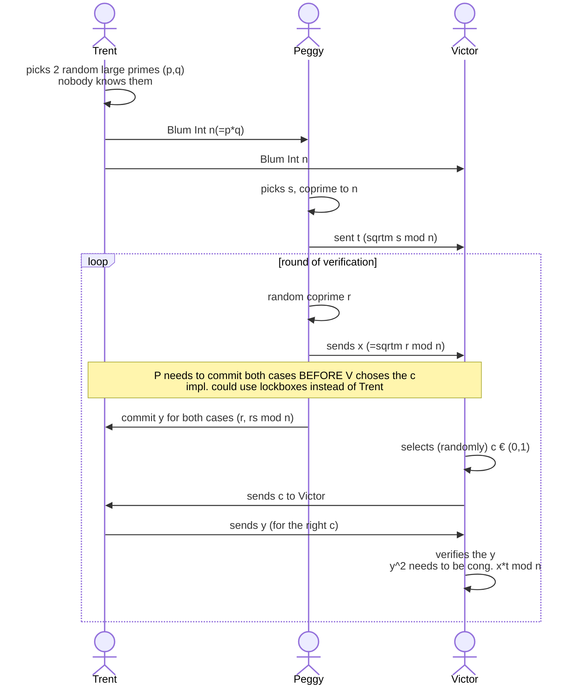

# Sequence Diagram (iterative )

  This is the first version of the sequence diagram

```mermaid

sequenceDiagram

actor Trent

actor Peggy

actor Victor

Trent->>Trent :picks 2 random large primes (p,q)<br/> nobody knows them

Trent->>Peggy: Blum Int n(=p*q)

Trent ->> Victor: Blum Int n

Peggy ->> Peggy : picks s, coprime to n

Peggy ->> Victor : sent t (sqrtm s mod n)

  

Loop round of verification

Peggy ->> Peggy : random coprime r

Peggy ->> Victor : sends x (=sqrtm r mod n)

Note over Trent,Victor: P needs to commit both cases BEFORE V choses the c <br/> impl. could use lockboxes instead of Trent

Peggy ->> Trent : commit y for both cases (r, rs mod n)

Victor ->> Victor : selects (randomly) c € (0,1)

Victor ->> Trent: sends c to Victor

Trent ->> Victor : sends y (for the right c)

Victor ->> Victor : verifies the y <br/> y^2 needs to be cong. x*t mod n

  

  

end

```